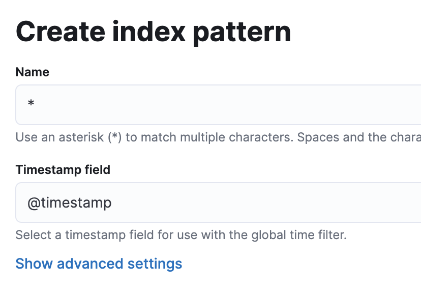
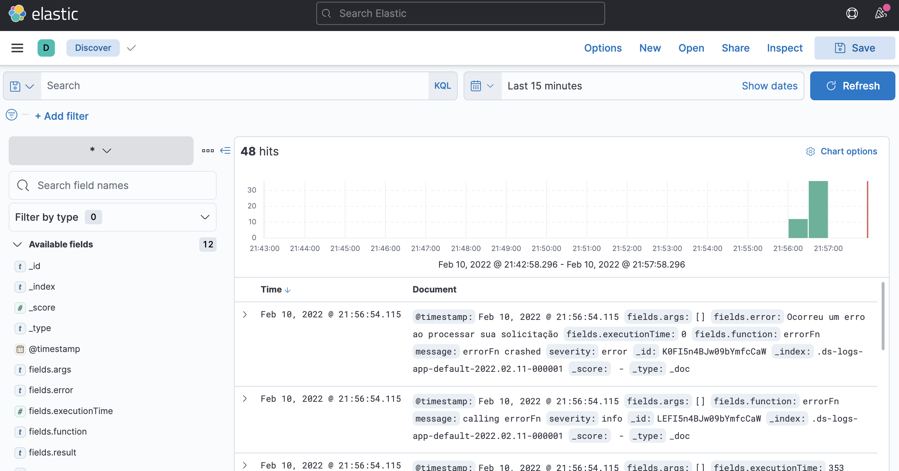
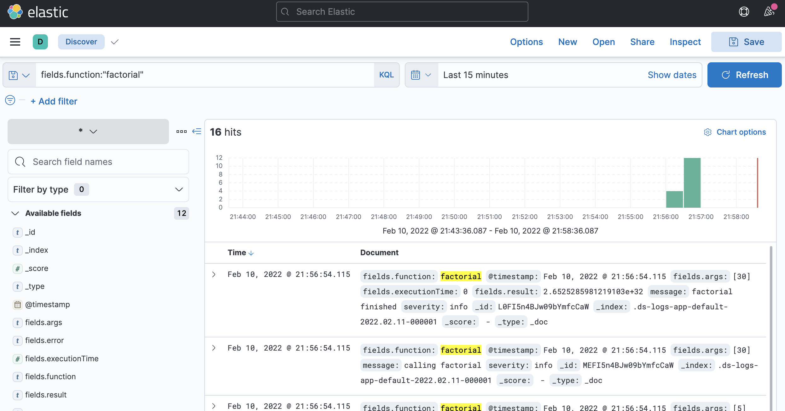
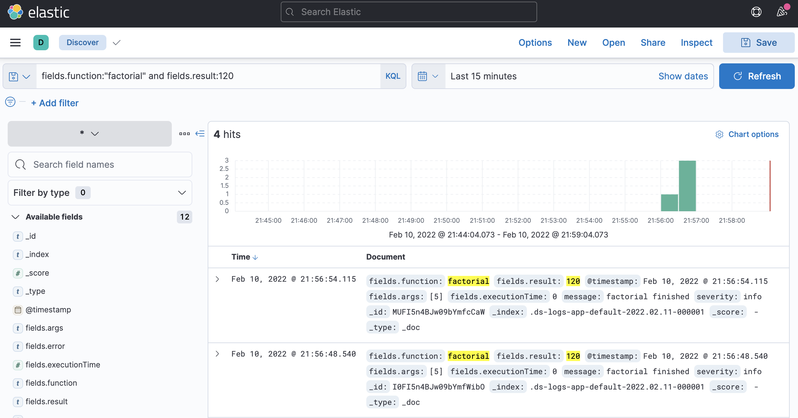
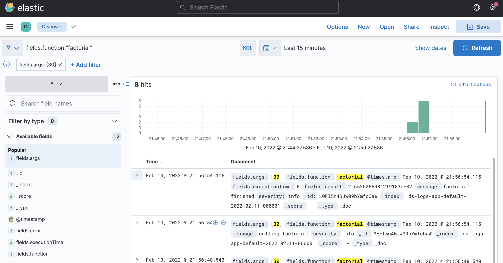
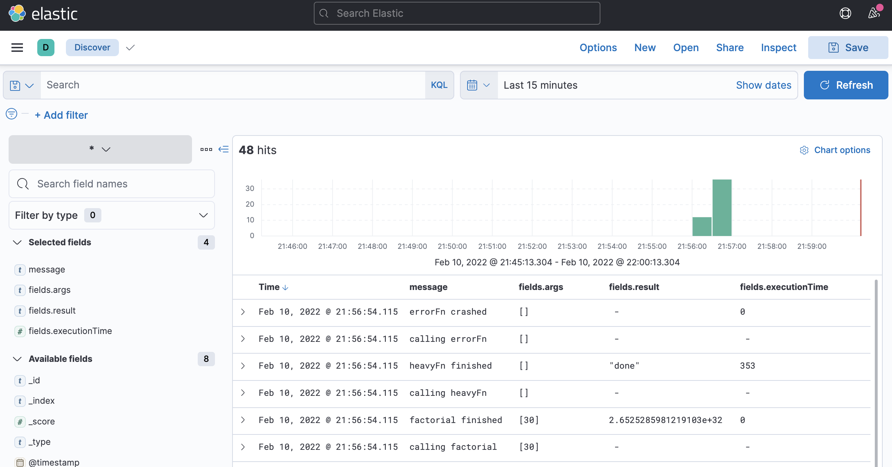

# log-elasticsearch

Logs são um dos três pilares da observabilidae. São extremamente importantes para identificar e entender o comportamento da aplicação.

Tão importante quanto escrever e persister logs é conseguir recuperá-los e analisá-los de forma ágil. Existe um universo de ferramentas e abordagens para escrita e recuperação de logs, alguns mais e outros menos eficientes. O objetivo desse projeto é explorar uma das possibilidades, usando Elastic Search para persistência e recuperação de logs, com auxílio do Kibana.

## O que vai encontrar nesse projeto

Primeiramente você vai encontrar um `docker-compose.yml` com a stack Elastic, contendo o Elastic Search e o Kibana, já conectado entre eles por uma network em comum e expondo as portas necessárias para interação com o host.

Você também vai encontrar o `logger.js`, um módulo responsável por criar e configurar um logger, baseado na biblioteca `winston` e seu plug-in para o ElasticSearch. Esse logger é exposto diretamente para ser usado. Em aplicações mais robustas, eu sugeriria criar um adapter para desacoplar a aplicação e evitar lidar diretamente com a API do winston.

Em `decorator.js` você vai encontrar um logger decorator. É uma implementação do design pattern decorator com a finalidade de gerar logs antes e depois da execução de uma função. Os logs gerados incluem algumas informações sobre sua própria execução e uma mensagem personalizada.

finalmente, em `index.js`, você vai encontrar uma demo de utilização do decorator, e por consequência, do logger. Ao executá-lo, ele irá criar algumas funções, decorá-las, e invocar. Isso vai gerar logs que serão enviados tanto para o ElasticSearch, quanto para o console (stdout).

## Executando

Para executar esse projeto você vai precisar do NodeJs (preferencialmente a última versão LTS) e docker + docker-compose. Opcionalmente pode usar o Yarn.

Ao clonar o projeto, você vai precisar instalar todas as dependências:
```
npm install
```

Para executar o projeto, serão dois passos. Primeiro iniciar a stack Elastic, usando docker-compose:
```
docker-compose up -d
```

Aguarde alguns segundos para que a stack tenha tempo de iniciar (você pode conferir os logs usando `docker-compose logs -f`)

Em seguida, poderá executar a aplicação:
```
npm start
```

Quando terminar seus testes, você pode finalizar a stack Elastic usando:
```
docker-compose down
```

## Consultando

Uma vez que os logs foram gerados, o grande diferencial aqui é a forma de consultá-los. Pra começar, acesse [localhost:5601](http://localhost:5601/).

Aqui você está acessando o Kibana, a ferramenta de análise da stack Elastic. Essa é uma ferramenta extremamente poderosa, que abre diversas possibilidades. Eu vou me limitar aqui a mostrar uma forma simples e flexível de buscar seus logs.

No menu principal (colapsável), acesse `Analytics -> Discover`, ou clique [aqui](http://localhost:5601/app/discover#/).

Se é a primeira vez que está acessando, vai precisar configurar o *index pattern*. Isso lhe permite conjugar ou separar os índices existentes.
Como temos apenas um índice criado, não temos muita alternativa, você pode configurar o pattern conforme a imagem abaixo:



Agora sim, você conseguirá acessar o `Analytics -> Discover`. Você verá uma interface parecida com essa:



Na área principal, você verá um histograma mostrando a distribuição dos registros no tempo, e abaixo a listagem dos registros encontrados.

Na barra "Search", você consegue montar queries personalizadas, utilizando os campos disponíveis:




Também é possível combinar filtros, que são facilmente acessíveis e interativos:



Por fim, é possível configurar a visualização dos logs de forma tabular, selecionando os campos que se deseja projetar.



Muitos outros recursos do Kibana podem ser explorados para analise e visualização dos dados.